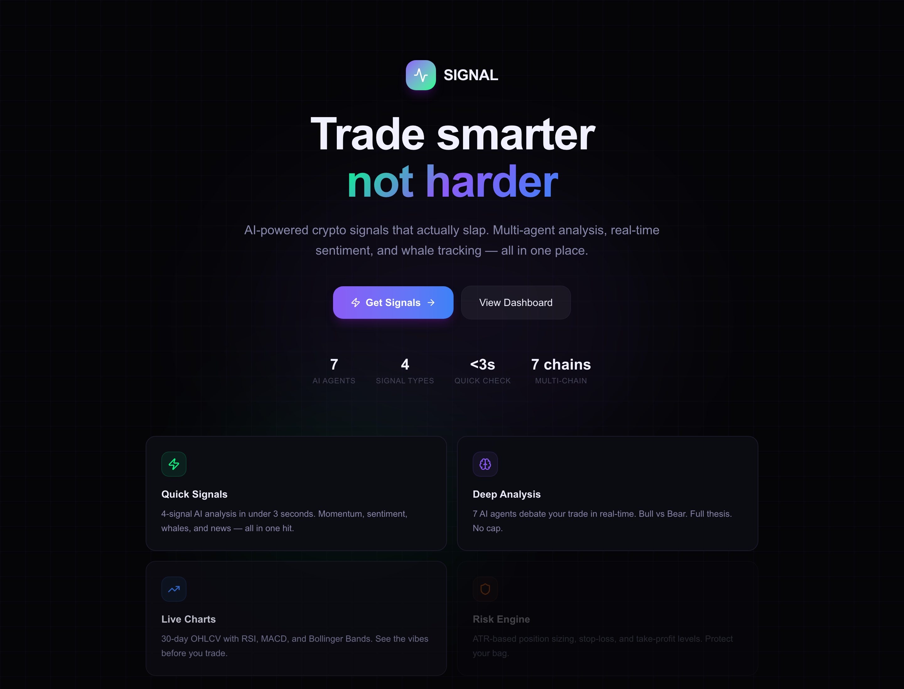
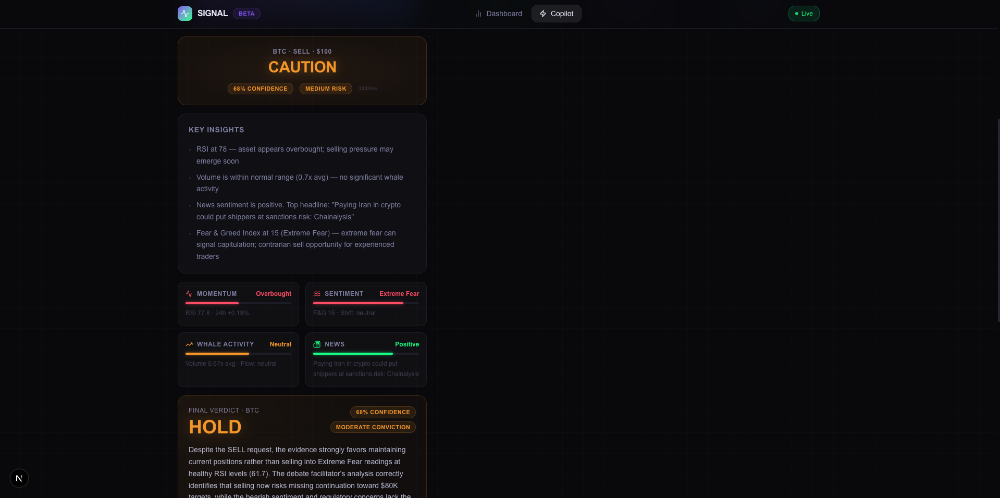
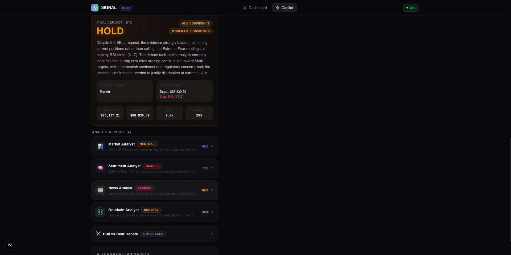

<div align="center">



# ⚡ SIGNAL

### AI-powered crypto trading copilot — *trade smarter, not harder*

Multi-agent analysis, real-time sentiment, whale tracking and live charts, all in one place.

[](https://github.com/Alg0-labs/signal/actions/workflows/ci.yml)


</div>

---

## What is SIGNAL?

SIGNAL turns a trade idea into a researched decision. Type an asset and an action,
and a fleet of AI agents pulls live market data, technical indicators, sentiment,
on-chain whale flow and breaking news — then debates it Bull vs Bear and hands you a
clear **BUY / SELL / HOLD** call with the reasoning, risk levels and confidence behind it.

- **Quick Check** — a fused 4-signal read in ~3 seconds.
- **Deep Analysis** — a 7-agent [LangGraph](https://github.com/langchain-ai/langgraph) workflow with an adversarial debate.
- **Talk to the chart** — ask questions about any window and get answers grounded in real news from that period (RAG).

---

## 📸 Screenshots

### Quick Check — a fast, fused signal
<p align="center">
  
</p>

### Deep Analysis — 7 agents debate your trade
<p align="center">
  
</p>

---

## ✨ Features

### 🤖 AI Copilot
- **Quick Check** — momentum, sentiment, whale and news signals fused into one severity score in ~3s.
- **Deep Analysis** — 7-agent workflow: 4 parallel analysts → Bull vs Bear debate → decision → risk engine.
- **Risk Engine** — ATR-based position sizing with stop-loss and take-profit levels.
- **Backtester** — RSI + MACD strategy backtested over up to 90 days of real OHLCV data.

### 📈 Market intelligence
- Live OHLCV candles, market data & volume history (CoinGecko).
- Indicators: RSI, MACD, ATR, Bollinger Bands; chart-pattern & order-flow heuristics.
- Fear & Greed index, trending detection and crypto news feeds.

### 🧠 RAG — "Talk to the chart"
- Scheduled news ingestion + embeddings (Voyage / Gemini) stored in Pinecone.
- Time-range-aware retrieval so answers match the chart window you're looking at.
- Degrades gracefully when RAG keys aren't configured.

### 👛 Wallet & on-chain
- Wallet snapshots via the Moralis indexer, cached in PostgreSQL (Prisma).
- Paged transaction history with USD valuation and AI chat over wallet context.
- `viem` transaction builder for native + ERC-20 transfers across **6 chains**
  (Ethereum, Polygon, BSC, Arbitrum, Optimism, Base).

### 🛡️ Production hardening
- Per-route rate limiting, Zod validation, CORS allow-list, 64 KB body cap.
- Response caching for charts & backtests, health-check endpoints.

> Full catalogue in [`docs/FEATURES.md`](docs/FEATURES.md) · system design in [`docs/ARCHITECTURE.md`](docs/ARCHITECTURE.md).

---

## 🧱 Tech stack

| Layer | Tech |
| --- | --- |
| **Frontend** | Next.js 16 (App Router), React 19, Tailwind CSS 4, Framer Motion, React Query, Zustand, lightweight-charts, Recharts |
| **Backend** | Node.js, Express, TypeScript, Zod |
| **AI** | Anthropic Claude, LangChain + LangGraph (multi-agent state graph) |
| **RAG** | Pinecone vector DB, Voyage / Gemini embeddings |
| **Data** | PostgreSQL + Prisma, Moralis, CoinGecko, Alternative.me |
| **Web3** | viem (multi-chain transaction building) |

---

## 🗂️ Project structure

```
signal/
├── backend/                  Express + LangGraph AI engine
│   ├── src/
│   │   ├── copilot/          agents, workflows, quick-check, RAG, backtest
│   │   ├── services/         ai, wallet, market, chart-chat
│   │   ├── routes/           REST API
│   │   ├── prompts/          system prompt + Claude tool schemas
│   │   └── utils/            tx-builder, token matcher, decoders
│   └── prisma/               PostgreSQL schema
├── frontend/                 Next.js app
│   └── src/
│       ├── app/              landing, copilot, dashboard pages
│       ├── components/       copilot, dashboard & UI kit
│       └── lib/              api client, binance, utils
├── docs/                     architecture & feature docs
└── assets/                   screenshots
```

---

## 🚀 Getting started

### Prerequisites
- Node.js 20+
- A PostgreSQL database (for wallet snapshots)
- An [Anthropic API key](https://console.anthropic.com/) (required)
- Optional: Moralis, Pinecone + Voyage/Gemini, for wallet & RAG features

### 1. Backend

```bash
cd backend
npm install
cp .env.example .env        # fill in your keys
npm run db:push             # sync the Prisma schema
npm run dev                 # http://localhost:3001
```

### 2. Frontend

```bash
cd frontend
npm install
npm run dev                 # http://localhost:3000
```

Open [http://localhost:3000](http://localhost:3000) and hit **Get Signals**.

### Environment

See [`backend/.env.example`](backend/.env.example) for the full list. The app
degrades gracefully — only `ANTHROPIC_API_KEY` is required to get signals; wallet
and RAG features light up as you add their keys.

---

## 🔌 API overview

| Method | Endpoint | Purpose |
| --- | --- | --- |
| `POST` | `/api/copilot/quick-check` | Fast 4-signal read |
| `POST` | `/api/copilot/deep-analysis` | Kick off the 7-agent workflow (async) |
| `GET`  | `/api/copilot/status/:sessionId` | Poll analysis progress |
| `GET`  | `/api/copilot/report/:sessionId` | Full analysis report |
| `POST` | `/api/copilot/backtest` | RSI + MACD backtest |
| `GET`  | `/api/copilot/chart/:symbol` | OHLCV + market + volume |
| `POST` | `/api/copilot/chart-chat` | RAG-grounded chart Q&A |
| `GET`  | `/api/wallet/:address` | Cached wallet snapshot |
| `POST` | `/api/chat` | AI chat over wallet context |

---

## 📦 Scripts

**Backend** — `npm run dev` · `npm run build` · `npm start` · `npm run db:push` · `npm run rag:ingest`
**Frontend** — `npm run dev` · `npm run build` · `npm start` · `npm run lint`

---

## 📄 License

[MIT](LICENSE) © Vibhu Dixit
